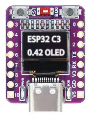
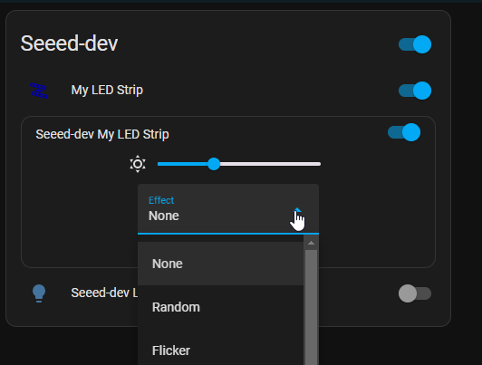
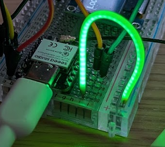
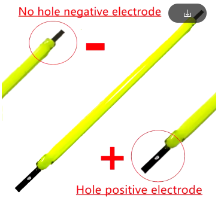

# YAML Collection.

## ESP32C3 - OLED 0.42:
Important to know the display is 72x40, ESPHome at pressent time (2025 Feb." does not have a 72x40 so use the 128x64 and offset with 28)

 

[AliExpress](https://www.aliexpress.com/item/1005007342383107.html?spm=a2g0o.order_list.order_list_main.181.21ef79d2pBUubG)

[YAML Test File](small-display-test.yaml)

## OLED 0.96
Larger display easer to workwith

[YAML Test File](./esphome-0.94%20SSD1303%20Display.yaml)

## Led strip 
Led strips - I normally use WLED, it is really flexable and has allot of extra functionality, but if you have to use the ESP32 for more that LED Strips, EXPHome offers alot od functionality that can be added on a ESP32 that is used for sensors or Display driver.

The default dashboard cart only have a on and foo switch, in order to have more functions exposed on the Dashboard for the LightStrip use the Custom [light-entety-card](https://github.com/ljmerza/light-entity-card) that is available in the HACS store. 

[YAML File](esphome-Light-strip.yaml)

## Single LED or LED Filiment
If you need to control a single LED you could use the [Status LED light](https://esphome.io/components/light/status_led.html) but it only controls on and off - Not brightness. Instead use [LEDC Output](https://esphome.io/components/output/ledc) 
The LED filement used here is from Ali express and uses 3Volts same as the pin output.

[Ali Express](https://www.aliexpress.com/item/1005007294507470.html?spm=a2g0o.order_list.order_list_main.89.7ae279d2L82cOK)

[YAML File](<esphome-Single LED.yaml>)

